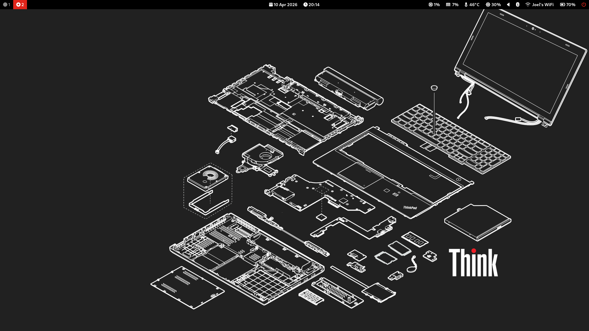
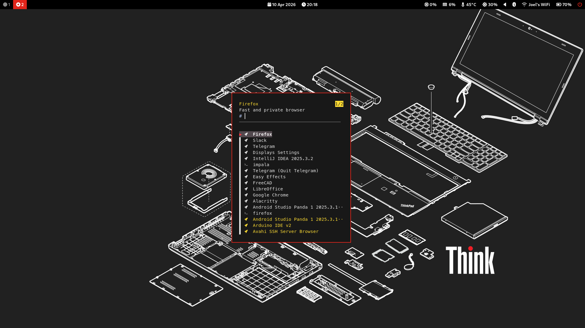
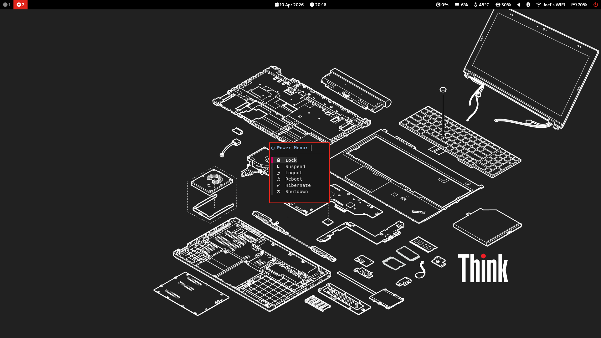

# DOTFILES
## Thinkpad ArchLinux Rice
This is my custom ArchLinux rice, designed to be clean, minimalist, 
and light on system resources — all while keeping an aesthetic 
inspired by ThinkPad colors.It’s optimized for battery life and 
performance on a ThinkPad L14 Gen 4 (Intel) setup.
### Screenshots
#### Desktop

#### Search menu

#### Power menu

